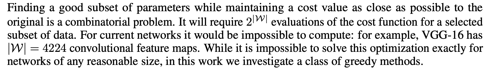
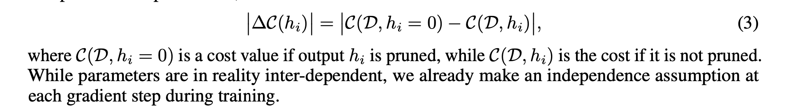
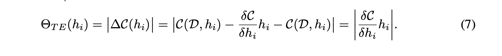
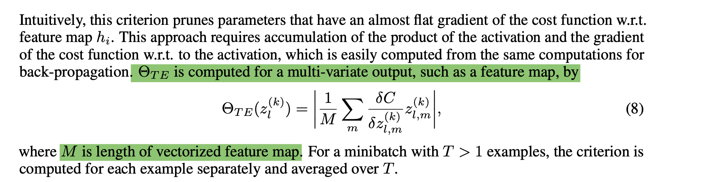
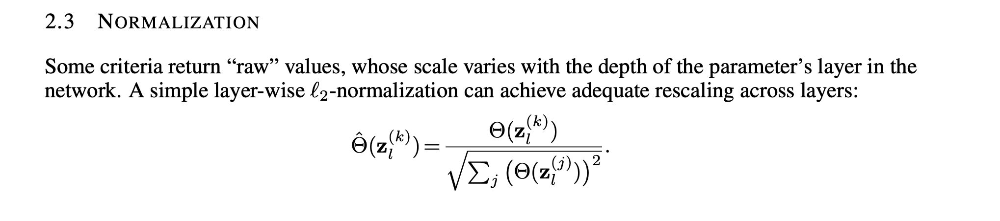
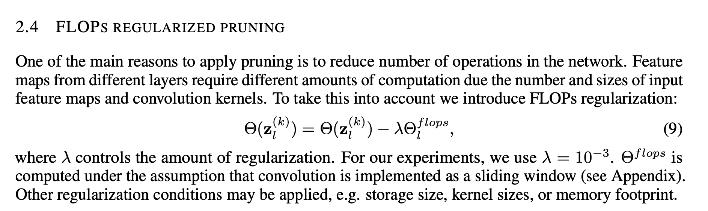

### Requirements
Main dependencies are pytorch and cuda. Based on python 3.7

```conda env create --name envname --file=environments.yml```
* Tested with CUDA 10.2

### Data

```source create_dataset.sh```

* Creates test and train DIR. Uses 1000 images for training and 400 for test. Feel free to change this by updating the script
* Requires kaggle CLI api. Alternatively download manually from https://www.kaggle.com/c/dogs-vs-cats/data and use then use the above script (commenting the kaggle api call)

### Code
* Refer vgg16_dogs_vs_cats_dataset.ipynb
* Transfer learning on pre trained VGG, replacing the classifier head for dogs_vs_cats dataset (2 class label)
```
model = models.vgg16(pretrained=True)
self.features = model.features #use the pre-trained feature head
for param in self.features.parameters(): #freeze the feature head
    param.requires_grad = False
self.classifier = nn.Sequential(
    nn.Dropout(),
    nn.Linear(25088, 4096), #output of last conv is 7x7x512 (25088). Feed that to FC layer
    nn.ReLU(inplace=True),
    nn.Dropout(),
    nn.Linear(4096, 4096),
    nn.ReLU(inplace=True),
    nn.Linear(4096, 2)) #final classifer is 2 category
def forward(self, x):
    x = self.features(x) #x.shape torch.Size([32, 512, 7, 7]) (batchsize 32)
    x = x.view(x.size(0), -1) #x.shape torch.Size([32, 25088])
    x = self.classifier(x) #x.shape torch.Size([32, 2])
  return x
```
* Initially fine tune the VGG on dogs_vs_cats dataset for 50 epochs, getting ___ accuracy
```
initial_training_obj.train(epoches=50)
```
* Prune 70% of the network parameters
  * Prune 32 filters in one iteration, re-train for 10 epochs and prune again till 70% of the network parameters are pruned
```
pruner_obj.prune(percentage_to_prune=70, num_filters_to_prune_per_iteration=32)
```


### Results

### Key points

*  Based on the paper [Pruning Convolutional Neural Networks for Resource Efficient Inference
](https://arxiv.org/abs/1611.06440)
* Recurring theme
  * Focus on transfer learning
  * Greedy criteria-based pruning of feature maps from convolutional layers
* Many pruning techniques require per layer sensitivity analysis which adds extra computations. For example, as descibed in - [ Pruning Filters For Efficient Convnets](https://github.com/rohinarora/Neural-Networks-Pruning/tree/master/1.%20Pruning%20Filters%20For%20Efficient%20Convnets)
  * In contrast, this approach relies on global rescaling of criteria for all layers and does not require sensitivity estimation.
  * Based on greedy criteria that approximates the change in the cost function induced by pruning network parameters
* Global optima of pruning combinatorially hard/exponential/infeasible. Use greedy methods.

* Algorithm-> (success hinges on employing the right pruning criterion)
  * Fine-tune the network until convergence on the target task
  * Alternate iterations of pruning and further fine-tuning. Feature maps are ranked globally, and then pruned
  * Stop pruning after reaching the target trade-off between accuracy and pruning objective
* Pruning criterion
  * Oracle pruning - Best case greedy. Computationally expensive. Infeasible.
  * Taylor expansion (Taylor pruning criterion a good heuristic)
    * minimize equation 3 given in [paper](https://arxiv.org/abs/1611.06440)
    * This equation approximates the change in cost function by pruning a single filter/feature map *hi*
    
    * Computation of final expression after simplification of taylor expansion is  product of the activation and the gradient of the cost function w.r.t. to the activation.
    
      * This is similar to terms found in backprop. (So additional computational for this expression not needed. We get its building blocks for free via backprop)
      * Intuitively, this criterion encourages to prunes parameters that have almost flat gradient of the cost function w.r.t. feature map *hi* (paper's notation)
  * For feature map (filter) within a CNN, pruning criterion given by gradient of the cost (error) over each feature map where M is the num of elements in a feature map, and averaged over all samples in a minibatch. Mathematically this is equation 8 in the paper
  
    * Sum over activation*gradient_of_activation to get score for the feature map
  * Layer wise L2 norm applied to equation 8. The scale of raw values varies with depth of layer. Layer norm normalizes them to be on same scale.
  
  * Optionally further regularized by FLOP regularization. FLOPs regularization takes into account that different layers require different amounts of computation. Encourages layers contributing higher FLOPs to be pruned more (scaled by regularization factor).
    * Layers which have high flops will have lower taylor score and will be promoted to prune
  
* Inspired by Jacob's nice [blog post](https://jacobgil.github.io/deeplearning/pruning-deep-learning)
